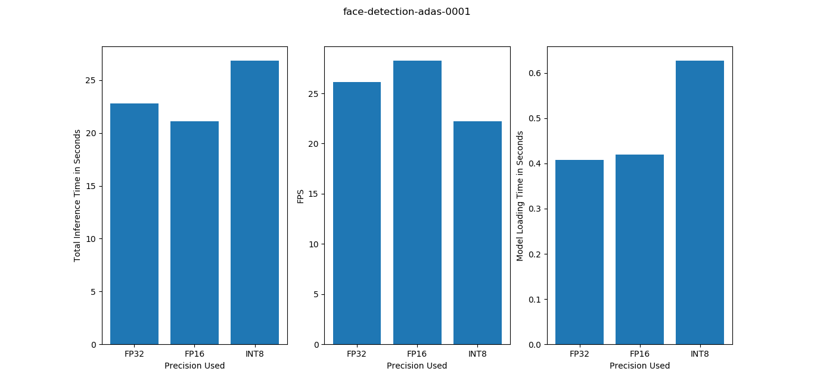
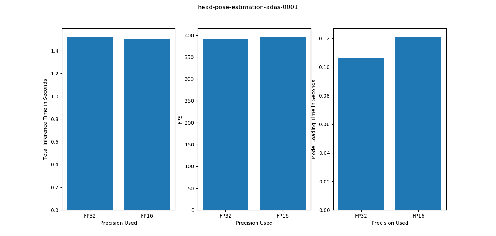
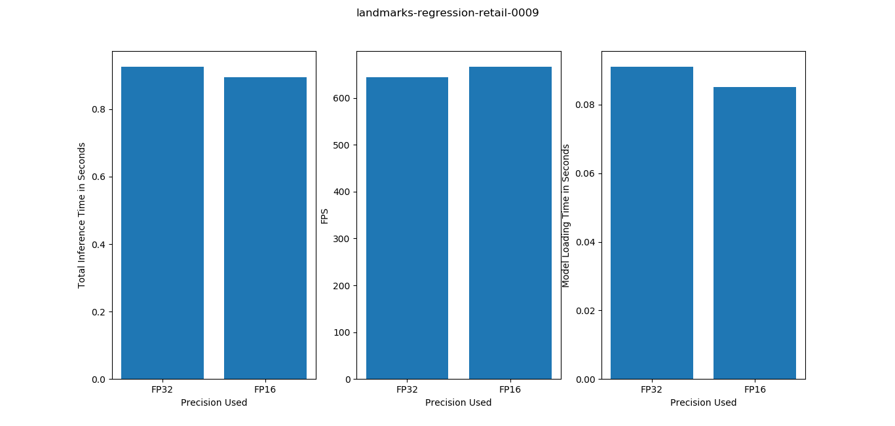
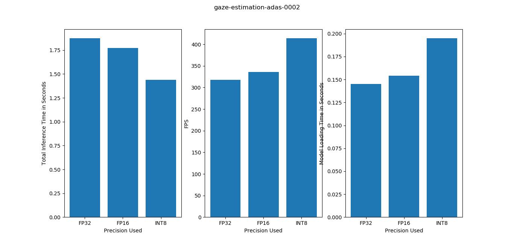

# Computer Pointer Controller

Computer Pointer Controller is an app to controll the mouse pointer by Gaze. The app uses webcam or a pre recorded video file or an image and using computer vision models, it predicts the gazing direction of the person present in the frame. From the gazing direction, the app then moves the mouse pointer to the gaze direction.

## Hardware Requirement
The app uses OpenVINO for faster inference from the computer vision models. OpenVINO requires Intel computing hardware. i.e. CPU, GPU, VPU, FPGA etc.

## Software Requirement
- Python 3
- OpenVINO
- OpenCV (python)
- Numpy
- PyAutoGUI

## Project Set Up and Installation
Change the working directory to the project folder and create a virtual environment.
```
virtualenv --system-site-packages -p python env
```
Activate the virtual environment. On windows, the command to activate the environment is as following:
```
env\Scripts\activate
```
Install the dependency's
```
pip install -r requirements.txt
```
Activate the OpenVINO environment before running the app. On Windows machine, for the default installation location of OpenVINO, the environment can be activated by following command. (If OpenVINO is not installed, install it first)
```
"C:\Program Files (x86)\IntelSWTools\openvino\bin\setupvars.bat"
```
The virtual environment and OpenVINO environment needs to be activated each time before running the app. The `environment.bat` batch file in the project folder can automate the process on Windows. Run the following in the command prompt.
```
environment.bat
```

The `bin` folder contains video file for demo.
The `model` folder contains all the necessary models.
The `src` folder contains the helper files for the `app.py` file.

The app needs 4 models to analyse the frames.
- [face-detection-adas-0001](https://docs.openvinotoolkit.org/latest/_models_intel_face_detection_adas_binary_0001_description_face_detection_adas_binary_0001.html)
- [head-pose-estimation-adas-0001](https://docs.openvinotoolkit.org/latest/_models_intel_head_pose_estimation_adas_0001_description_head_pose_estimation_adas_0001.html)
- [landmarks-regression-retail-0009](https://docs.openvinotoolkit.org/latest/_models_intel_landmarks_regression_retail_0009_description_landmarks_regression_retail_0009.html)
- [gaze-estimation-adas-0002](https://docs.openvinotoolkit.org/latest/_models_intel_gaze_estimation_adas_0002_description_gaze_estimation_adas_0002.html)

The models' documentation can be found in their respective pages.

## Demo
For running a demo of the app, run the following command,
```
python app.py -s video
```
The app will use the `demo.mp4` video file in the `bin` folder to run the demo.

## Arguments
The app takes one required command line argument and some optional command line arguments. Run the file with a `-h` argument to see the details of all the arguments.
```
python app.py -h
```

- `-s` : Define the source of the video file. 'cam' for webcam input, 'video' for pre-recorded video file, 'image' for an image.
- `-f` : If the source is set to be a pre-recorded video file or image, use this argument to pass the source file location.
- `-d` : Specify device which will be used to run the inference on. By default, device is CPU
- `-e` : Some models might need extension file for the specified device to support custom layers. Default is set to the extension file for CPU device on Windows. If specified device is something else, or the extension file is located in different location, user needs to provide the appropriate extension file.
- `-m1`: The app reads the source by frame then the frame is send to the model specified by this argument to detect face in the frame. If face is detected, the frame is cropped to the face and then the cropped image is send to the next two models specified by `-m2` and `-m3`.
- `-m2`: Specify the model location that is used to estimate the head pose from the cropped image. The output from this model is required to run the gaze estimation model.
- `-m3`: Specify the model location that is used to detect the location of the eyes. The ouput from this model is two cropped images of the left and right eye. These two images are required to run the gaze estimation model.
- `-m4`: Specify the model location that is used to estimate the gaze of the detected person. This model requires the head position, left eye image and right eye image from the two earlier models.
- `-r` : This flag is used by the user to see results from the intermediate models. Default is -1, which displays the video with final x, y outputs. 1 is used to show the cropped image from face-detection model. 2 is used to see the estimated head position. 3 is used to show the cropped image of the eye. 0 is used to keep the video display off.

User can quit the app by pressing `q`.

## Benchmarks
The app is tested on Intel Core i5-4200M CPU. Performance on other hardwares are untested. The app was tested for different model precisions and measured performance are total inference time, FPS and model loading time.

## Results
The benchmark results for the models are shown in the following graph. It is obsereved that lower precision model increases the inference performance of the model. Although the face-detection-adas-0001 model performs best on FP16 precision and worst on INT8. Performance of gaze-estimation-adas-0002 is best at INT8 precision. Model loading time is lowest for FP32. But as model is loaded once, this has low impact on app's performance.






### Best Precision Combinations
From the benchmark test, the best precision combinations for the model based on their FPS performance on CPU are found to be as following,

| Model                              | Precision   |
| ---------------------------------- | ----------- |
| face-detection-adas-0001           | FP16        |
| head-pose-estimation-adas-0001     | FP16        |
| landmarks-regression-retail-0009   | FP16        |
| gaze-estimation-adas-0002          | INT8        |

However, the performance may change in different hardware. For example, INT8 precision is not supported on VPUs and other hardwares might be optimized for different precisions.

### Edge Cases
In case of multiple persons on the frame, the app will use only the face that it detects with the highest confidence. In case, the first model detects no face in the frame, it will continue to the next frame.
